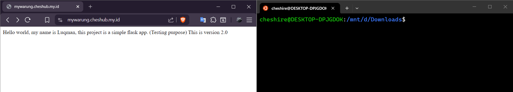
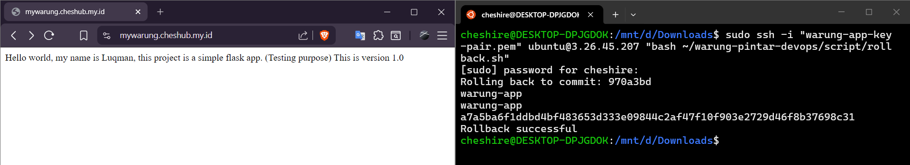
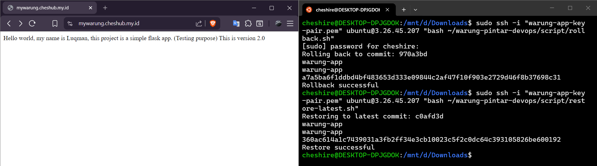
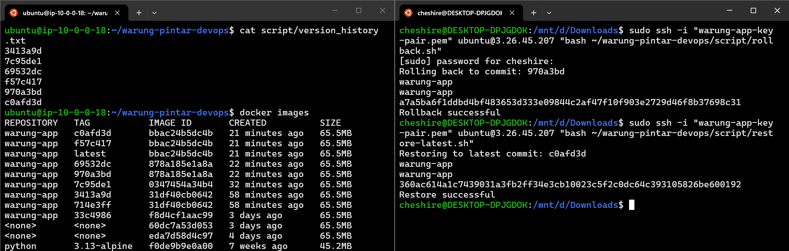

# Warung Pintar DevOps Project

## Business Context

A small-to-medium B2B company provides a web-based stock management 
and cashier platform for local small businesses (UMKM) in Indonesia. 
The company currently serves 200 active merchant clients daily. Their 
technical team consists of a few developers and designers, with no 
dedicated DevOps engineer.

Several critical problems emerged:
- Deployments were done manually, causing frequent mismatches between 
  development and production environments
- No rollback mechanism when a bad deployment occurred
- No monitoring system to proactively detect server issues — problems 
  were only discovered after merchants complained

These issues caused unnecessary downtime and wasted developer time 
that should have been spent building features.

The company brought in a DevOps engineer to solve these problems under 
two key constraints: a limited budget and a one-week deadline.

---

## Architecture & Tech Stack

### Architecture Diagram


### Tech Stack

| Technology | Purpose |
|---|---|
| Python + Flask | Lightweight backend service |
| Gunicorn | WSGI HTTP server for running Flask in production |
| Docker | Containerization for consistent environments |
| Nginx | Reverse proxy and SSL termination |
| Let's Encrypt | Free SSL certificate |
| Cloudflare | DNS management, DDoS protection, and CDN |
| GitHub Actions | CI/CD pipeline automation |
| AWS EC2 t2.micro | Cloud server (Free Tier) |
| Netdata | Lightweight all-in-one server monitoring |

### Why These Choices

**Python + Flask** — Minimal boilerplate, lightweight, and widely documented. 
Appropriate for a backend service focused on infrastructure rather than 
complex business logic.

**Docker** — Eliminates environment mismatch between development and 
production. Any server with Docker installed can run this application 
identically.

**Nginx** — Handles incoming traffic as a single entry point, forwards 
requests to the Flask container, and terminates SSL so the application 
does not need to handle it.

**GitHub Actions** — Free for public repositories, integrated directly 
with the codebase, and requires zero additional infrastructure.

**AWS EC2 t2.micro** — Chosen for its Free Tier eligibility. Sufficient 
for the current scale of this project. Not intended as a long-term 
production choice — see Improvement Plan.

**Netdata** — Single-command installation, zero configuration required, 
and provides real-time metrics out of the box. Appropriate for a team 
without a dedicated DevOps engineer.

---

## CI/CD Pipeline

### Flow
```
Developer pushes to main branch
        ↓
GitHub Actions triggered
        ↓
SSH into EC2 server
        ↓
Pull latest repository
        ↓
Build new Docker image
        ↓
Stop old container → Start new container
```

When a developer pushes changes to the `main` branch, GitHub Actions 
automatically triggers the deployment pipeline. The runner establishes 
an SSH connection to the EC2 server using credentials stored as GitHub 
Secrets — never hardcoded. On the server, the latest code is pulled, 
a new Docker image is built, and the running container is replaced with 
the updated version.

### Pipeline Runs


---

## Deployment Guide

### Project Structure
```
.
├── README.md
├── app
│   ├── app.py
│   ├── gunicorn.conf.py
│   └── requirements.txt
├── docker
│   └── Dockerfile
├── documentation
└── nginx
```

### Prerequisites

- Python 3.13
- Docker
- Git

### Local Setup

1. Clone the repository
```bash
git clone https://github.com/karasu126/warung-pintar-devops.git
cd warung-pintar-devops
```

2. Create and activate virtual environment
```bash
python -m venv venv

# Linux/Mac
source venv/bin/activate

# Windows
venv\Scripts\activate
```

3. Install dependencies
```bash
pip install -r app/requirements.txt
```

4. Run locally
```bash
# Development
python app/app.py

# Production (use Gunicorn)
gunicorn app:myapp
```

### Available Endpoints

| Endpoint | Method | Response |
|---|---|---|
| `/` | GET | Welcome message |
| `/health` | GET | `{"status": "ok"}` |

---

## Monitoring

Netdata is used as the monitoring solution — an all-in-one tool that 
handles both metric collection and visualization in a single package. 
A lightweight agent runs on the EC2 instance and forwards metrics to 
Netdata Cloud, accessible via browser from anywhere.

Metrics monitored include:
- CPU usage
- RAM usage
- Disk I/O
- Network traffic
- Docker container health

### Monitoring Dashboard


---

## Rollback Mechanism

Each deployment builds a Docker image tagged with the Git commit hash — 
for example `warung-app:a3f2c9d`. Every successful deployment appends 
the commit hash to `version_history.txt` on the server, creating a 
traceable record of all deployed versions.

This makes rollback straightforward: if the latest version has issues, 
the previous image is still available on the server and can be restored 
in seconds without rebuilding.

Two scripts are available in the `script/` directory:

| Script | Purpose |
|---|---|
| `rollback.sh` | Revert to the previous deployed version |
| `restore-latest.sh` | Return to the latest version after a rollback |

### How to Use

**Rollback to previous version:**
```bash
ssh -i key.pem ubuntu@EC2_HOST "bash ~/warung-pintar-devops/script/rollback.sh"
```

**Restore to latest version:**
```bash
ssh -i key.pem ubuntu@EC2_HOST "bash ~/warung-pintar-devops/script/restore-latest.sh"
```

### Evidence

App before rollback — latest version running normally:


After rollback — container reverted to previous version:


After restore — container back to latest version:


Version history on server:


---

## Improvement Plan

- **Rollback automation** — implement automated rollback triggered by 
  failed health checks after deployment, removing the need for manual 
  intervention
- **Autoscaling** — migrate to AWS Auto Scaling Group to handle 
  unexpected traffic spikes
- **Image registry** — push Docker images to Docker Hub or AWS ECR 
  to decouple build and deploy stages
- **Kubernetes** — migrate container orchestration to Kubernetes for 
  better scalability and resilience as merchant count grows
