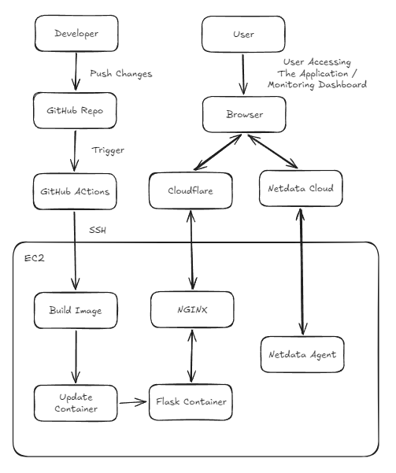
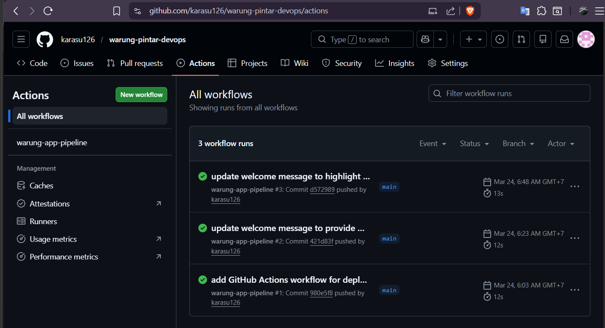
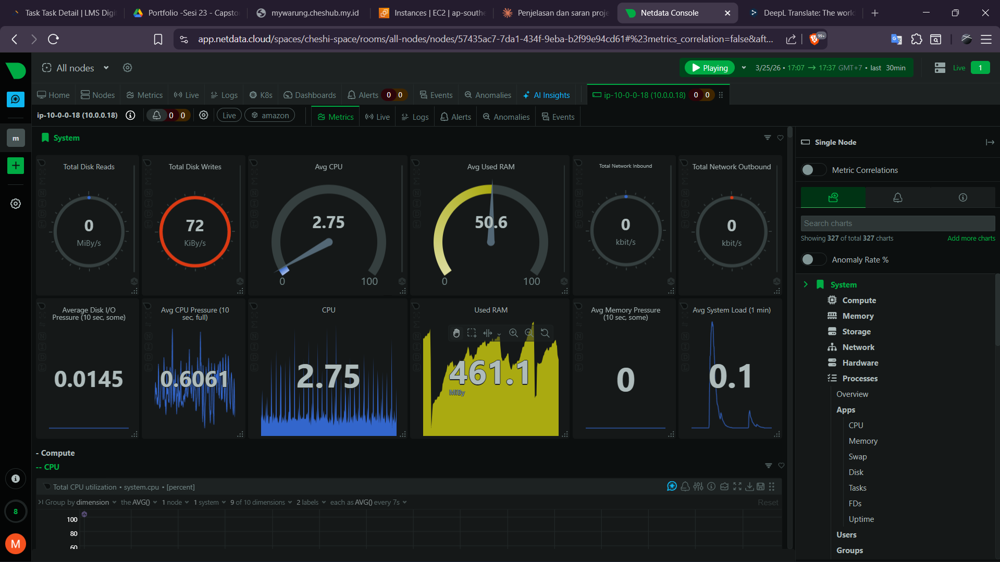

## Business Context

A small-to-medium B2B company provides a web-based stock management 
and cashier platform for local small businesses (UMKM) in Indonesia. 
The company currently serves 200 active merchant clients daily. Their 
technical team consists of a few developers and designers, with no 
dedicated DevOps engineer.

Several critical problems emerged:
- Deployments were done manually, causing frequent mismatches between 
  development and production environments
- No rollback mechanism when a bad deployment occurred
- No monitoring system to proactively detect server issues — problems 
  were only discovered after merchants complained

These issues caused unnecessary downtime and wasted developer time 
that should have been spent building features.

The company brought in a DevOps engineer to solve these problems under 
two key constraints: a limited budget and a one-week deadline.

## Architecture & Tech Stack

### Diagram Architecture


### Tech Stack
- Python
- Docker
- NGINX
- GitHub Action
- Netdata

Python - Digunakan untuk membuat web aplikasi dengan Flask. Python termasuk bahasa pemrograman high level (dekat dengan bahasa menusia) yang populer sehingga dokumentasi termasuk sangat lengkap.

Python - will be used to build web application with Flask library. Python is one of the most popular high level programming language. 

Docker - Digunakan untuk menjalankan container yang membungkus aplikasi Flask python.

Docker - Will be used to running container that wrap an Flask application.

NGINX - Digunakan sebagai reverse proxy atau pintu masuk tunggal dari trafik yang masuk, lalu trafik akan diteruskan ke kontainer aplikasi. NGINX juga digunakan untuk melakukan terminate SSL yang menggunakan Let's Encrypt.

NGINX - Will be used as reverse proxy or single gateway from incoming traffic, then the traffic will be forwarded to application container. NGINX also used to terminate SSL that use Let's encrypt.

GitHub Action - Digunakan untuk mengimplementasikan CI/CD pipeline yang akan mengupdate source code aplikasi pada server setiap kali developer melakukan push perubahan source code.

Github ACtion - Will be used to implement CI/CD pipeline that will automatically update the container application with newest image every time a developer push the application source code changes to github repository.

Netdata - Digunakan untuk menjalankan monitoring sistem dalam satu paket fungsi karena Netdata yang akan mengambil informasi dari sevrer dan juga memvisualisasikannya melalui dashbord, dimana dashborad ini dapat diakses melalui browser. 

Netdata - Will be used to run a system monitoring in one function package because netdata will handle of collecting server metrics and visualize it in single web based dashboard monitoring. 

## CI/CD Pipeline

### Alur

Push changes -> pipeline CI/CD triggered -> SSH to server -> Pull newest repo  -> Build image -> Update container

Developer melakukan push perubahan dari source code aplikasi ke repositori github. Aksi push tersebut akan memicu aktifnya pipeline CI/CD yang dimulai dari GitHub Actions runner melakukan SSH ke server EC2. Setelah berhasil terkoneksi dengan server melalui SSH, akan dilakukan aksi pull repositori github terbaru. Kemudian, akan dibuat sebuah image aplikasi beserta dependensinya. setelah image dibuat, container akan diupdate image-nya sehingga akan berjalan dengan image versi terbaru.

Developer make a application resource code changes and then push it to github repository. The push action will trigger CI/CD to active. Start from GitHub actions runner make SSH connection to EC2 server. On the EC2 server, newest github repository will be pulled. Then, image container will be created and the container will be updated with the image. 

### Pipeline Runs


## Deployment Guide

### Project structure

```
.
├── README.md
├── app
│   ├── app.py
│   ├── gunicorn.conf.py
│   └── requirements.txt
├── docker
│   └── Dockerfile
├── documentation
└── nginx
```

### Environment Setup

1. Install Python
Recommended:
```
python:3.13
```
2. Create virtual environment (recommended)

```bash
python -m venv venv
source venv/bin/activate
```

Windows:

```bash
venv\Scripts\activate
```
3. Install dependecies

```
pip install -r requirements.txt
```

Dependencies:

| Package          | Purpose                                                      |
| ---------------- | ------------------------------------------------------------ |
| Flask            | Lightweight Web framework for building backend service       |
| Gunicorn         | WSGI HTTP server for running Flask application in prodcution |

4. Running Pyton Flask app

If you not in production environment and your current position is in root (/) repository then run this command:

```
python app/app.py
```

If you not in production environment and your current position is in app/ subrepository then run this command:

```
python app.py
```

Important Note:
If you in prodution environment you should to use gunicor instead of python.
Example:
```
gunicorn app:myapp
```

## Monitoring

### Netdata

Monitoring software used in this project is simple and lightweight all in one monitoring sistem netdata. Netdata will use kind of agent to collect metrics on instance server then forward it to single monitoring dashboard. Dashboard monitoring will give informations about server health such as CPU, RAM. network, docker container. 

### Monitoring Dashboard


## Improvement Plan

- Implement rollback machanism to mitigate if the newest version application goes wrong.
- Implement auto scaling schema to handle unexpected trafik load using AWS auto scaling service.
- Implement Docker Hub or artifact registry if the source code changes often occur.
- Implement kubernetes to handle massive amount of contianer when the scale of application goes bigger.